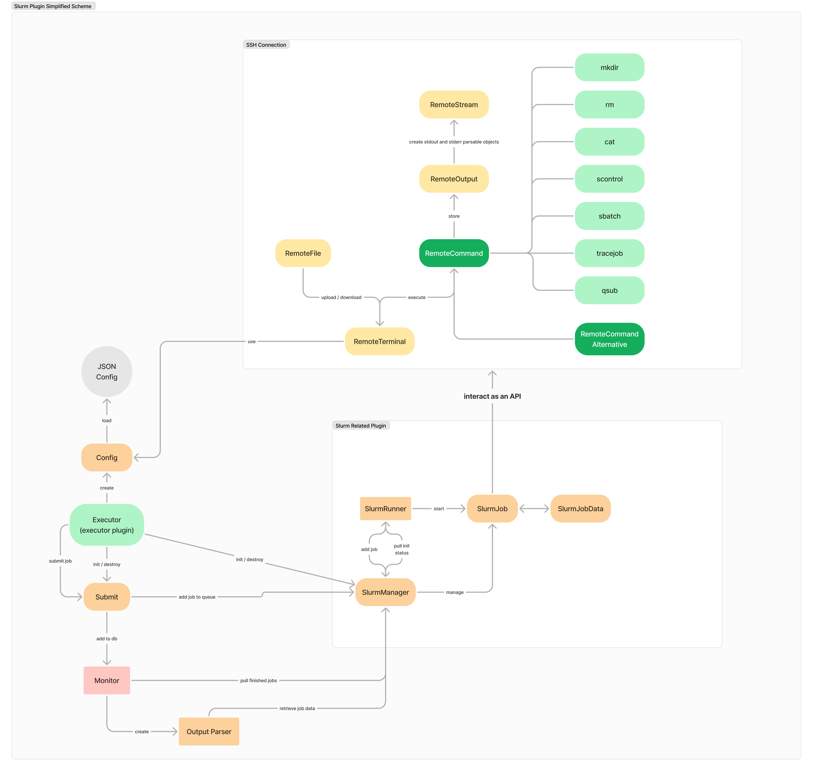

# GASW-Slurm-Plugin

# Supported orchestrations tools
This plugin allow to support two orchestrations tools Slurm and PBS.  
[Differences between PBS and Slurm](https://www.youtube.com/watch?v=iNIflomRn00)

> [!IMPORTANT]
> **Slurm** and **PBS** are very similar in fact.

## PBS !?
> [!NOTE]
> If you have never used PBS before, take a look at those links !
> [Portable Batch System](https://en.wikipedia.org/wiki/Portable_Batch_System)
> [Docs](https://ncar-hpc-docs.readthedocs.io/en/latest/pbs/job-scripts/#listing-of-frequently-used-pbs-directives)

## Slurm !?
> [!NOTE]
> If you have never used Slurm before, take a look at those links !
> [QuickStart Installation](https://slurm.schedmd.com/quickstart_admin.html)
> [Overview / User guide](https://slurm.schedmd.com/quickstart.html)
> [Useful commands](https://curc.readthedocs.io/en/latest/running-jobs/slurm-commands.html)

## Plugin
### Description
This plugin is used in the case of [Virtual-Imaging-Platform](https://www.creatis.insa-lyon.fr/vip/) project.  
It is called from the *engine motor* and then utilised in completition of [GASW](https://github.com/virtual-imaging-platform/GASW).  

### Prerequisite
To run this plugin you need to use at least **Java 21** runtime environnement.  
You should also provide **config.json** file witch contain the information about the plugin it self (the location shall be */var/www/cgi-bin/slurm/config.json*).  

### Working
To deal with PBS and Slurm we use an SSH connection witch replace the API of the Kubernetes plugin for example.  

## Code
### Structure
This a figma scheme of the global structure of the classes of the project.  

### Updates
If you want to update the code you might easily what you want.  
Also if a command output changes and the plugin do not work anymore you can just have a look inside *internals/command/items/mybrokenjava.java* and adapt the result function.  
There is some little parsing tools inherit from the **RemoteStream** class.  